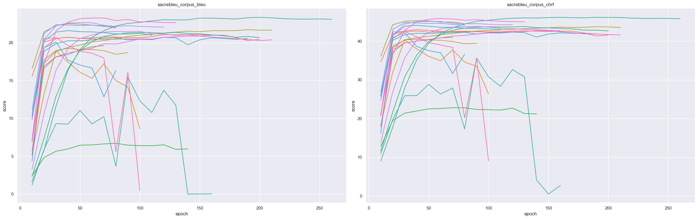
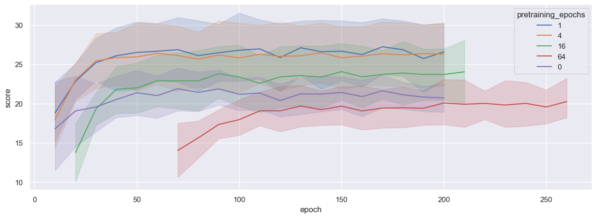
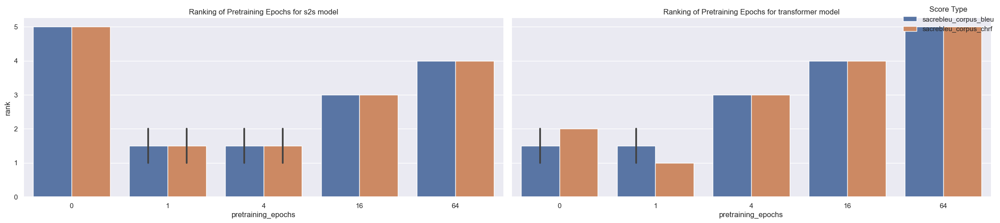
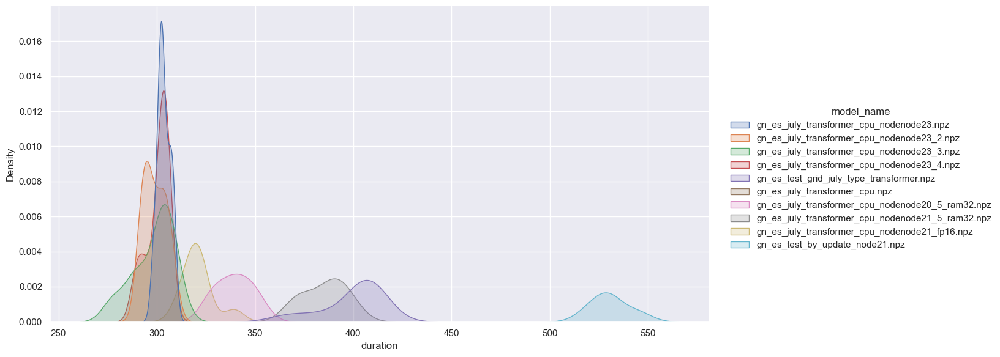

# NLP - Neural Machine Translation (gn-es) using data augmentation

The project is a wrapper around the MarianNMT Machine Translation software. 
It is part of our university thesis project, where we try to enhance the Guaraní-Spanish
translation quality by implementing a syntax grammar capable of generating millions of
syntactically correct sentence pairs in both languages.

Its main features and content are:
- Formatting raw data:
    - Guaraní-Spanish corpora from Chiruzzo et. al
    - Augmented data from parallel guaraní-spanish grammar (https://github.com/AlexisBaladon/tesis-guarani)
- Model `training` and `validation` (with the aid of **MarianNMT**)
- Parallel hyperparameter tuning using `grid search` or `random search`.
- Generation of results using `cached` models through different experiments.
- Analysis of results using `bleu` and `chrf` as main `evaluation metrics`
- `Bash` and `Slurm` scripts to run the project in a `cluster` (https://www.cluster.uy/) with parallel tasks inside a `singularity` container using multiple `GPUs`.

# Results

The most relevant results of our project are:
- Generating a parallel Guaraní-Spanish using syntactically correct
parallel phrases in both languages from which we used 1.000.000 tokens.
- Achieving SOTA scores in the recently created Guaraní-Spanish benchmark parallel corpus (Chiruzzo et. al) 
using SOTA Deep Learning models (transformers and seq2seq) and regularization techniques such as `dropout`, `label smoothing` and `exponential smoothing`.
- Achieving a `chrF` score of 47 and a `BLEU` score of 25 for the best model and direction, using the `sacrebleu` library.
- Testing the effectiveness of data augmentation in a low resource language (Guaraní) using our syntax grammar.

## Metrics per epoch of s2s model in es-gn direction:

## Metrics per epoch of pretrained models by number of pretrained epochs:

## Ranking of each number of pretraining epochs for each model architecture (1st rank is the best):

## Time duration tests to make a most efficient use of the GPU:

# Libraries

The project mainly uses the next libraries:
- [os] - Provides operative system functionalities in order to ease file handling.
- [pandas] - Provides functionalities to manipulate structured data.
- [matplotlib] - Plot functionalities for data analysis
- [seaborn] - Wrapper around matplotlib to make the analysis faster.
- [sacrebleu] - Library used to standarize metric evaluation without the need of tokenization.

# Folder structure:

The project structure is based on many open-source Machine Learning projects,
but the main inspiration is: https://github.com/krishnaik06/mlproject/ from Kirish Naik.