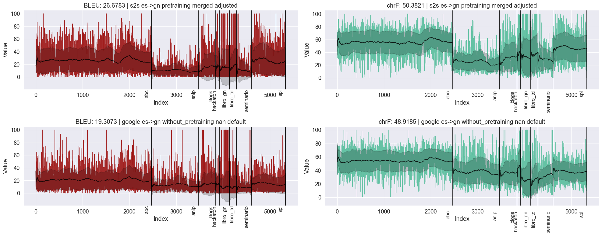
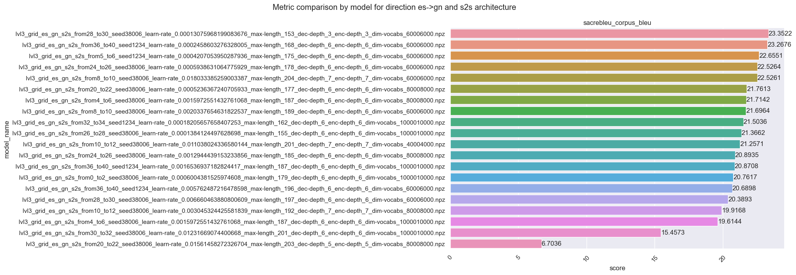
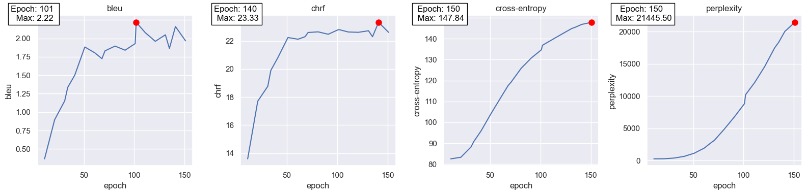

# NLP - Neural Machine Translation (gn-es) using data augmentation

📙 Don't forget to check our notebooks at `notebooks/src`!

🌲 Check our [Syntax Grammar](https://github.com/AlexisBaladon/SyntaxGrammar-es-gn) for gn-es parsing and generation!

The project is a wrapper around the MarianNMT C++ Machine Translation software. 
It is part of our university thesis project, where we aim to enhance the Guaraní-Spanish
translation quality by implementing a syntax grammar capable of generating millions of
syntactically correct sentence pairs in both languages.

# Achievements

## Surpassed Google GCP Translation in the es->gn direction using seq2seq models.

# Tech

- [marianNMT] - Efficient Open-Source C++ Neural Machine Translation framework supporting multi-GPU training and inference.
- [Docker] - Containerization platform utilized for reproducibility and portability.

# Libraries

- [pandas] - Provides functionalities to manipulate structured data.
- [matplotlib] - Plot functionalities for data analysis
- [seaborn] - Wrapper around matplotlib to make the analysis faster.
- [sacrebleu] - Library used to standarize metric evaluation without the need of tokenization.
- [os] - Provides operative system functionalities in order to ease file handling.

# Results

## Metrics per epoch of s2s model in es-gn direction:

These are the results obtained by our best model in the validation set,
tuned using `random search`, `early-stopping`, `sentencepiece unigram tokenization` and 
regularization methods such as `dropout`, `label smoothing` and `exponential smoothing`.

If you want to see all the results, I encourage you to check the notebooks in the `notebooks/src` folder :).

The most relevant results of our project are:
- Generating a parallel Guaraní-Spanish using syntactically correct
parallel phrases in both languages from which we used 1.000.000 tokens.
- Achieving 26.2075 BLEU in the Guaraní-Spanish parallel corpus (Chiruzzo et. al) test set **surpassing Google** in the es->gn direction and getting competitive results (less than 1 BLEU of difference) in gn->es.
- Achieving more than 26 `BLEU` in both directions, applying Deep Learning models (`transformers` and `seq2seq`) and regularization techniques such as `dropout`, `label smoothing` and `exponential smoothing`.
- Testing the effectiveness of data augmentation in a low resource language (Guaraní) using our syntax grammar.

## Features

Its main features and content are:
- Formatting raw data:
    - Guaraní-Spanish corpora from Chiruzzo et. al
    - Augmented data from parallel guaraní-spanish grammar (https://github.com/AlexisBaladon/tesis-guarani)
    - Ancora-mini dataset translated to Guaraní by our syntax grammar.
    - Parallel Guaraní-Spanish Bible corpus.
- Model `training` and `validation` (with the aid of **MarianNMT**)
- Parallel hyperparameter tuning using `grid search` or `random search`.
- Generation of results using `cached` models through different experiments.
- Analysis of results using `bleu` and `chrf` as main `evaluation metrics`
- `Bash` and `Slurm` scripts to run the project in a `cluster` (https://www.cluster.uy/) with parallel tasks inside a `singularity` container using multiple `GPUs`.
- Automatic parsing and plotting of marianNMT logs using Regular Expressions:

# Folder structure

The project is composed by the following modules:

- **Artifacts**: Contains the input data and output models. The created corpora and hyperparameters tuned are contained in this folder.
- **Notebooks**: Contains the notebooks used for the analysis of the results.
- **Scripts**: Contains the bash scripts used to run the project in a cluster:
    - The `setup` folder contains scripts to setup the project environment, including the script to download the used docker container.
    - The `cluster` folder contains scripts used to make experiments.
    - The `ingestion.bat` script is used to create the vocabulary and divide the jojajovai dataset in train/dev/test subsets.
    To reuse this scripts it is necessary to adjust directory paths to coincide with the current environment. No scripts receives extra flags.
- **Src**: Contains the source code of the project with the features mentioned above.
- **Tests**: Contains the unit tests used to test the features before using the software in the cluster.
- **main.py**: Main file of the project used to run MarianNMT. Use main.py --help to see each flag's description.
- **cluster_runner.py**: Script used to divide jobs within cluster nodes.

